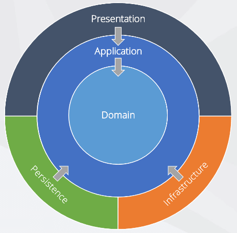

# Onion(soğan) arxitekturası

C# və ya digər dillər ilə backend development edərkən, proyektimiz çox böyüyə bilər, belə olan hallarda əgər proyektimizi doğru struktur və ya arxitektura ilə işləmiriksə, ona yeni özəlliklər əlavə etmək və ya ümumiyyətlə onda müəyyən dəyişikliklər etmək çox vaxtımızı ala bilər. Bunun üçün proqramçılar illərdir fərqli dizayn patternlər hazırlayırlar. Misal olaraq adicə hər kəsin bildiyi MVC(model-view-controller) özü bir dizayn patterndir və ya MVVM(model-view-view-model). Lakin, bəzən dizayn patternlər belə bizə bəs etməyə bilər. Bu zaman köməyimizə fərqli arxitekturalar gəlir. Bunlardan ən məhşurları: N-Tier Architecture(ənənəvi), Onion architecture, Hexagonal architecture - dir. Bu günki məqaləmizdə Onion(soğan) arxitekturasından danışacağıq və N-Tier Architecture arasında olan fərqləri, müsbət və mənfi cəhətlərini müzakirə edəcəyik. Elə isə ilk sualımıza cavab tapaq nədir N-Tier Architecture?

## N-Tier Architecture nədir?

N-tier arxitekturası təməlində proyekti birdən çox səviyyələrə bölməyi hədəfləyən və hər hədəfin arasında ardıcıl əlaqəni təmin edən arxitekturalardan biridir. Adında N olması proyektin birdən çox levellərə bölünə bilməyinə icazə verir. Ənənəvi olaraq şəkildə də görüldüyü kimi, proyekt ya 3(bəzən SQL Server ilə Data Tier birləşdirilir) ya da 4 level-ə bölünür. Bu arxitekturanın ənənəvi olaraq qəbul edilməsinin səbəbi illərdir dominantlıq göstərməsi olub. Lakin N-tier arxitekturanın əsas mənfisi, arxitekturanın təməlində data səviyyəsinin olmasıdır bu isə, bütün proyektin bir növ database-dən asılı olmasına gətirib çıxarır, yəni gələcəkdə ORM texnologiyası dəyişilməli olsa və ya Code-First əvəzinə Db-First-ə keçid olunmağa cəhd olsa bu böyük problemlər yaşadasıdır. Digər bir problem isə, proyekt hər nə qədər levellərə bölünsə də levellərin arasında sıx əlaqə var, və əgər Presentation levelinin sadəcə Data tərəfi ilə işi varsa yenə Business levelindən keçməli olur. Bu özü böyük bir problemdir. Bu kimi problemlərin(mənfi xüsusiyyətlərin) həlli üçün təklif edilən ən məhşur arxitekturalardan biri Onion arxitekturası və digəri də Hexagonaldır. Təbii ki, tək bu iki arxitekturalar mövcud deyil sadəcə ən çox tərcih edilən arxitekturalar bu ikisidir.

## Onion arxitekturası, müsbət və mənfi cəhətləri

 
Onion arxitekturasını güclü edən, onun levellərinin arasında sıx əlaqə olmaması və birindən digərinə rahat bir şəkildə keçidin olmasıdır. Adının soğan olması isə arxitekturanın quruluşuna görədir. Gəlin nəzər salaq:

Soğan kimi, iç içə qabıqların olması ona soğan adını qazandırıb.
Bu arxitekturanı güclü edən digər bir, ünsür isə N-tier -dən fərqli olaraq, Data bölməsinin mərkəzdə olmamasıdır. Bu bizə gələcəkdə database-lə əlaqədar texnologiya dəyişikliklərində çox rahatlıq verəcək.
Şəkildən də göründüyü kimi arxitekturanın: Domain, Application, Infrastructure, Persistence və Presentation adlı bölmələri var, gəlin onlara qısaca nəzər salaq:

### Domain:

Bu bölmə ən azad bölmədir və heç bir leveldən asılı deyil. Çox vaxt bu leveldə, Entity-lər, Enum-lar, Entity-lərə aid Exception və sair saxlanılır.

### Application:

Fərqli mənbələrdə bu bölməyə, Repository Interfaces, Services Interfaces kimi adlar verilir ancaq həmişə domaindən gələn kimi yadda saxlamaq olar. Bu bölmənin əsas məqsədi abstraction(mücərrədlik) təmin etməkdir və Domain ilə birbaşa əlaqədə olur. Əsasən bu bölmədə: Service Interface-lər, DTO-lar, ViewModel-lər, Validator-lar və sair saxlanılır.

### Persistence:

Database ilə birbaşa əlaqədə olan səviyyədir. DbContext, Migration-lar, Seeding ,Repository-lərin concrete sinifləri burda saxlanılır.

### Infrastructure:

Bəzən Persistence səviyyəsi ilə birləşdirilib bir səviyyə kimi götürülür(tərcih məsələsidir). Persistence-dən ayrıldığı zaman isə, əlavə olan işlərin məsələn email-ə data göndərmək və sair burada yazılır.

### Prensentation:

Presentation bölməsi isə, istifadəçi tərəfi nümayiş elətdirir. Burda əsasən, Viewlar, API controllerlər, Page-lər olur.

Ümumilikdə, Onion arxitekturasını tətbiq etmək, proyektlərimi gələcək ehtiyaclar üçün daha açıq edir. Əsas üstünlüyü gördüyümüz kimi, asılıqların minimala salınması(heç vaxt asılılıqdan tam qurtulmaq olmaz sadəcə minimum-a salmaq olar), kodun idarəsinin asanlığı və texnologiya dəyişiklərinə açıq olmasını göstərmək olar.
