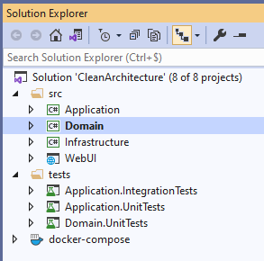

# Onion(soğan) arxitekturası 🧅

C# və ya digər dillər ilə backend development edərkən, proyektimiz çox böyüyə bilər, belə olan hallarda əgər proyektimizi doğru struktur və ya arxitektura ilə işləmiriksə, ona yeni özəlliklər əlavə etmək və ya ümumiyyətlə onda müəyyən dəyişikliklər etmək çox vaxtımızı ala bilər. Bunun üçün proqramçılar illərdir fərqli dizayn patternlər hazırlayırlar. Misal olaraq adicə hər kəsin bildiyi MVC(model-view-controller) özü bir dizayn patterndir və ya MVVM(model-view-view-model). Lakin, bəzən dizayn patternlər belə bizə bəs etməyə bilər. Bu zaman köməyimizə fərqli arxitekturalar gəlir. Bunlardan ən məhşurları: N-Tier Architecture(ənənəvi), Onion architecture, Hexagonal architecture - dir. Bugünkü məqaləmizdə Onion(soğan) arxitekturasından danışacağıq və N-Tier Architecture arasında olan fərqləri, müsbət və mənfi cəhətlərini müzakirə edəcəyik. Elə isə ilk sualımıza cavab tapaq, nədir bu N-Tier Architecture?

## N-Tier Architecture nədir?

 

N-tier arxitekturası təməlində proyekti birdən çox səviyyələrə bölməyi hədəfləyən və hər hədəfin arasında ardıcıl əlaqəni təmin edən arxitekturalardan biridir. Adında N olması proyektin birdən çox levellərə bölünə bilməyinə işarə edir. Ənənəvi qaydada şəkildən də göründüyü kimi, proyekt ya 3(bəzən SQL Server ilə Data Tier birləşdirilir) ya da 4 level-ə bölünür. Bu arxitekturanın ənənəvi olaraq qəbul edilməsinin səbəbi, illərdir verdiyi "rahatlıq" ilə dominantlıq göstərməsi olub. Lakin N-tier arxitekturanın əsas mənfi cəhəti, arxitekturanın təməlində data səviyyəsinin olmasıdır bu isə, bütün proyektin bir növ database-dən asılı olmasına gətirib çıxarır, yəni gələcəkdə ORM texnologiyası dəyişilməli olsa və ya Code-First əvəzinə Db-First-ə keçməyə cəhd olsa bu böyük problemlər yaşadacaqdır. Digər bir problem isə, proyekt hər nə qədər levellərə bölünsə də levellərin arasında sıx əlaqə var, və əgər Presentation levelinin sadəcə Data tərəfi ilə işi varsa yenə Business levelindən keçməli olur. Bu özü böyük bir problemdir. Bu kimi problemlərin(mənfi xüsusiyyətlərin) həlli üçün təklif edilən ən məhşur arxitekturalardan biri Onion arxitekturası və digəri də Hexagonaldır. Təbii ki, alternativ olaraq yalnız bu iki arxitektura mövcud deyil sadəcə ən çox tərcih edilən arxitektura ikisindən biridir.

## Onion arxitekturası, müsbət və mənfi cəhətləri

 

Onion arxitekturasını güclü edən, onun levellərinin arasında sıx əlaqə olmaması və birindən digərinə rahat bir şəkildə keçidin olmasıdır. Adının soğan olması isə arxitekturanın quruluşuna görədir.Soğan kimi, iç içə qabıqların olması ona soğan adını qazandırıb.
Gəlin nəzər salaq:
 
Bu arxitekturanı güclü edən digər bir ünsür isə, N-tier -dən fərqli olaraq Data bölməsinin mərkəzdə olmamasıdır. Bu bizə gələcəkdə database-lə əlaqədar texnologiya dəyişikliklərində çox rahatlıq verəcək.
Şəkildən də göründüyü kimi arxitekturanın: Domain, Application, Infrastructure, Persistence və Presentation adlı bölmələri var, gəlin onlara qısaca nəzər salaq:

### Domain:

Bəzən adına Core da deyirlər. Bu bölmə ən azad bölmədir və heç bir leveldən asılı deyil. Çox vaxt bu leveldə: Entity-lər, Enum-lar, Entity-lərə aid Exception və sair saxlanılır. Proyektin döyünən ürəyi olmasına baxmayaraq maksimum şəkildə asılılıqlardan qurtarılıbdır.

### Application:

Fərqli mənbələrdə bu bölməyə, Repository Interfaces, Services Interfaces kimi adlar verilir. Bu bölmənin əsas məqsədi abstraction(mücərrədlik) təmin etmək və Domain ilə birbaşa əlaqədə olmaqdır. Əsasən bu bölmədə: Service Interface-lər, DTO-lar, ViewModel-lər, Validator-lar və sair saxlanılır və ən əsası Business logic dediyimiz bölmə olur(bəzən Infrastructure bölməsinə də əlavə edilir).

### Persistence:

Database ilə birbaşa əlaqədə olan səviyyədir. DbContext, Migration-lar, Seeding ,Repository-lərin concrete sinifləri burda saxlanılır.

### Infrastructure:

Bəzən Persistence səviyyəsi ilə birləşdirilib bir səviyyə kimi götürülür(tərcih məsələsidir). Persistence-dən ayrıldığı zaman isə, əlavə olan işlərin məsələn email göndərmək, bildirim göndərmək kimi işlər burada yazılır.

### Prensentation:

Presentation bölməsi isə, istifadəçi tərəfi nümayiş elətdirir. Burda əsasən, Viewlar, API controllerlər və Page-lər olur.

Misal olaraq aşağıdakı, şəkilə baxmaq olar:
 

Görüldüyü burda, Persistence və Infrastructure səviyyələri birləşdirilib bir səviyyədədir. Eləcə də əlavə olaraq _tests_ layer-i var. Bu isə arxitekturanın genişlənməyə açıq olduğunu göstərir, yəni istədiyimiz kimi arxitekturanı səviyyələrə bölə bilər və ya əsas nəzəriyyəni saxlamaqla kiçildə bilərik.

Ümumilikdə, Onion arxitekturasını tətbiq etmək, proyektlərimizi gələcək ehtiyaclar üçün daha açıq edir. Əsas üstünlüyü gördüyümüz kimi, asılıqların minimala salınması(heç vaxt asılılıqdan tam qurtulmaq olmaz sadəcə minimum-a salmaq olar), kodun idarəsinin asanlığı və texnologiya dəyişiklərinə açıq olmasıdır.
